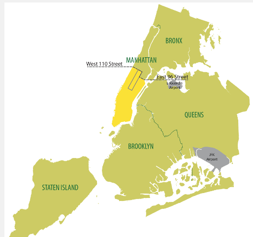

<p align=center><p>

# <h1 align=center> **PROYECTO FINAL - Grupo 4 (Data PT 09)** </h1>

# <h1 align=center>**`Análisis Integral del Sector de Transporte de Pasajeros en Nueva York`**</h1>

<p align="center">

</p>

<hr>  

## **Descripción del proyecto**

**Staff:**
- Juan Aponte - Product Manager/Cloud Arquitect
- Facundo Dispenza - Data Engineer
- Agustín Niederle - Data Scientist
- Gabriel Cañete - Machine Learning Engineer
- Diego Camacho - Data Analyst

## Contexto

¿Sabían que los primeros taxis de Nueva York fueron eléctricos? Así fue. La época dorada del carro eléctrico empezó en 1911, cuando Thomas Edison creó nuevas baterías recargables a base de hierro y níquel, que aumentó la velocidad y la autonomía de este tipo de vehículos. Y es más, el record de velocidad de un vehículo fue instalado por un carro eléctrico. Aunque fue ampliamente usado en esta ciudad, terminó por ser desplazado por el modelo de Henry Ford y su motor a combustión porque resultaba mucho más rentable. Durante la gran depresión económica de Estados Unidos, los hombres desocupados recurrieron sus autos para trabajar y la ciudad se llenó de taxis. El tiempo pasó y por diversas razones, los taxis se vovlieron parte de la escencia y de la personalidad de esta gran ciudad.

<p align="center">

</p>

Actualmente, sólo en la ciudad de nueva york, hay miles de taxis funcionando de manera continua. Parte de esto gracias a la política que buscó convertir a la matrópolis en una "ciudad que no duerme". Para esto, cada taxi necesita de tres choferes: uno por cada turno. Pero es importante destacar para nuestro análisis general, que se pueden encontrar tres tipos diferentes de texis: Amarillos, Verdes y Negros. En terminos generales, podemos decir que cada color indica en qué zonas tiene permitido transitar. Esto se debe a normativas que fueron necesarias para controlar y manejar la sobredemanda de Taxis. El taxi de color amarillo, por ejemplo, es el único que tiene permiso para subir y bajar pasajeros en Manhattan, que es la zona más popular y transitada de la ciudad. Para esto, los taxis amarillos tienen que comprar su registro de habilitación y así acceder a trabajar en dicha zona, que además, es por mucho la más rentable. Este registro llegó al valor en bolsa de un millón de dolares en 2011, pero ante la aparición de Uber cayó alrededor de los 200 mil dólares. Este registro es limitado, si uno quiere comprar uno debe esperar que un taxi esté dispuesto a venderlo; diámica usada para evitar que haya más taxis de los que puedan necesitarse. Esto generó un conflicto por los registros de habilitación para taxis amarillos, como es de imaginarse. Conflicto que no hizo más que empeorar con la llegada del Uber al mercado (autos negros).

<p align="center">

</p>

En 2021, a cuasa de la crisis ambiental, el presidente Biden aprobó una ley que busca renovar los taxis por modelos modernos con combustibles de energía alternativa, con el fin de reducir el impacto ambiental de este servicio de transporte. En nueva york, ya existen diversas estaciones de energía eléctrica -principal energía alternativa en el país-, lo que hace operativamente posible el objetivo de la ley: un recambio total de los automóviles para finales el 2025. Actualmente los taxis amarillos se encuentran en crisis, debido a que los taxis particulares que captan sus clientes y no les permiten subir la tarifa a un valor que les resulte rentable para pagar los prestamos que sacaron para comprar las habilitaciones. Por esto, los taxis verdes (que trabajan fuera de Manhattan), son los que aún permiten el ingreso de nuevos servicio, pero ¿de qué manera se podría realizar de una manera rentable?. En este trabajo buscaremos responder esta pregunta clave.

## Público Objetivo
Empresa de transporte de pasajeros a larga distancia que busca introducir taxis en Nueva York.

## Propuesta de sectorización del negocio
Creemos conveniente para esta empresa que busca ingresar a otorgar servicios de taxis, introducir su servicio específico para los pasajeros de los servicios de transporte de larga distancia (autobuses y aviones). Actualmente pasan por los aeropuertos de nueva york, más de 10 millones de pasajeros por mes (13 millones en julio de 2024, ver Fuente *). Esto permitiría captar una zona del mercado lo suficientemente grande y que aún no posee la competencia y la sobreoferta presente en el servicio actual de taxis convencionales.

[fuente](https://www.panynj.gov/airports/en/statistics-general-info.html)*

## Perfil diferenciador del negocio
Hemos hecho incapié en ser ecológicamente activos a la hora de pensar el nuevo servicio de taxis. Por esto, creemos que nuestro diferencial, respecto a otros servicios de transporte que captan clientes en los aeropuertos, debe que provenir desde esta búsqueda; tanto para los usuarios como para la empresa de taxis. Desde el punto de vista de la empresa, también resulta de gran utilidad y eficiencia económica, porque conocer o estimar el número de clientes para poder ingresar al aeropuerto/terminal sólo con las unidades necesarias permitiría eliminar las esperas inútiles y los lapsos de actividad no rentados.

## Propuesta General

Crear una app que asocie a los pasajeros que hacen caminos similares o van a destinos en las mismas zonas de NY, para recomendarles viajes compartidos en taxis eléctricos que permitan un servicio cómodo, de menor costo y más comprometido ecológicamente, ya que permite ayudar a reducir congestiones de tráfico, ruido ambiente y, sobre todo, la huella de carbono. :muscle:


## **Análisis Propuesto:**
Conocer las oportunidades, costos y posibles ganancias de un nuevo servicio de taxis en la ciudad de Nueva York.
  
## **Objetivos Puntuales:** 
Teniendo en cuenta la información de estaciones de carga eléctrica, el modelo y el rendimiento de vehículos, los costos del combustible, impuestos y peaje, las zonas más congestionadas y sus restricciones legales, nos planteamos poder recomendar un tipo de servicio rentable que, además, esté planteado con facilidades para el despliegue de un negocio con proyección. Incluyendo una APP para la reserva y la recomendación de los mejores caminos posibles para el taxi y modelo de recomendación para acompañantes manejado por el usuario, quien además podrá conocer el ahorro de su huella de Carbono gracias al uso de sservicio de viajes compartidos.
  
## **Alcance del proyecto**
Generar un respaldo de datos, estructura y stack tecnológico para la inteligencia suficiente durante el despligue y puesta en marcha del negocio planteado. Una vez operativo el serivicio, la aceptación del serivicio y el crecimiento de usuarios dependerá de factores no tratados en este análisis (publicidad, presencia institucional, calidad del serivicio, por ejemplo).

## **Propuesta comercial del trabajo**
Todo viajero o viajera desea llegar y tener resuelta la lelgada al hotel, o el regreso a su casa. Luego de un larguísimo viaje entre aeropuertos, o durante horas enteras en la ruta, aún no hemos llegado al destino. Aún falta el último paso. Aún puede que nos cobren más de lo que corresponde, que nos lleven por el camino más largo, que sea tarde y no consigamos servicio, que todos los taxis estén ocupados y la espera y el viaje se alargue aún más, etc. Nada resultaría más útil que poder resolverlo con facilidad, claridad y confianza. Por esto, AirTaxi crea una solución: facilitar el último paso de tu viaje.

**`Modelos ML`**:
Al asociarnos con las empresas de bus (incluso la propia) y las de aviones, se podrí captar a clientes antes de que toquen la pista de aterrizaje usando una APP que les permita reservar su viaje, identificando la zona de destino: esto permitirá sugerir al usuario los compañeros de viaje según el destino y otras preferencias a indicar en la misma (primer modelo ML) y tambien, los caminos óptimos al chofer del Taxi en cuestión (segundo modelo ML). 
Consiguiendo los datos de vuelos y de empresas de transporte de larga distancia, para conocer el número los pasajeros que llegan a NY por día y horario, podemos estimar la cantidad de usuarios potenciales. Al conocer el costo de enería electrica por auto por hora, podríamos tener valores certeros del negocio.


**`KPIs` propuestos**:

+ a KPI 1: Shared travel (% de reducción de la huella de carbono): 
Descripción: Cantidad de CO2 reducido al compartir el viaje (en el caso de los autos eléctricos sería el CO2 de la producción de la energía eléctrica que usa por el viaje). A mayor cantidad de personas por viaje, menor es el valor.

+ b KPI 2: Reducción del tiempo de inactividad/espera por vehículo.
Descripción: Los tiempos de inactividad por falta de pasajeros se pueden reducir al generar reservas previas por medio de la app, pero además se puede plantear una triangulación entre aeropuertos y terminales para que el chofer tenga las distancias entre pasajeros lo más cortas posibles.

+ c KPI o eficiencia operativa= (tiempo de viaje con pasajero)/tiempo total 
*Tiempo total = tiempo de recarga de energía + tiempo de viaje con pasajero + tiempo de viaje sin pasajero (regreso a estación, por ejemplo)
Descripción: Mide cómo la APP puede reducrir los tiempos de esperay optimizar la ganancia del chofer y de la empresa.  

**Detalles Técnicos**
Se adjunta un diccionario de los datos otorgados, que permiten entender con mayor claridad la información obtenida por la exploración analítica de los mismos.
[link](EDAs/Diccionarios de datos de los datasets.docx)

## **feature-analytics-bi**
#
# ✔️```Análisis preliminar de la calidad de los datos (EDA)``` 

Bajo la misma línea de pensamiento de Urban Green Solutions, sin perder de vista los objetivos planteados en el proyecto y con la finalidad de obtener un panorama real del estado y los retos a los que nos enfrentamos, se realiza un análisis preliminar de los datos:
Para ello se extraen de las Agencias gubernamentales NYC Taxi and Limousine Comisión y Environment & Health de New York datos reales y actuales útiles para trabajar este proyecto.


El análisis consta de 6 sets de datos:

1. **Electric and Alternative Fuel Charging Stations:** Este dataset contiene información sobre las estaciones de carga de combustibles alternativos para vehículos (electricidad, Gas Natural, Gas Licuado, Gas de biodigestores, Etanol e hidrógeno) en EE.UU., después de analizar los datos se obtuvieron los siguientes insights:
    - Existen gran cantidad de nulos por columnas especificas de cada tipo de combustible, sin existir problema filtrando data.
    - Casi 60k estaciones son destinadas para todo publico
    - Mas de 45k estaciones abren las 24 horas 
    - Mas de 10k estaciones de carga ofrecen carga de vehículos eléctricos de forma gratuita y otras más solo cobran tiempo de estacionamiento
    - En NY existe un total de 3409 estaciones de carga para vehículos eléctricos y mas de 600 ofrecen servicio gratuito. 17%.


2. **Vehículos ligeros:** Este dataset contiene información adicional de 1993 a 2022 sobre vehículos ligeros (autos a camionetas hasta 2.7 ton) en él se almacenan datos referentes a tipo de combustible eficiencia de combustible alternativo (ciudad, carretera y combinado), los datos más importantes son:
    - La fábrica predominante es Ford
    - La categoría de estos vehículos predominante es sedan/wagon y le sigue SUV
    - Casi 15% son vehículos eléctricos.


3. **Electric Car Data:** Con la finalidad de apegarse a la normativa en NY, se analiza este set de datos que contiene la información de los autos eléctricos disponibles en el mercado de EE.UU. La información relevante contenida es:
    - No existen datos nulos 
    - Existen información de marca, modelo, eficiencia, autonomía, Precio, entre otras 
    - Existen outliers en eficiencia y precio


4. **Taxy-zones:** Con la finaldad de estudiar y conocer las zonas en donde transitan los taxis en NY se analiza este dataset, el mismo contiene la siguiente información: 
    - Las ciudades de New York
    - Áreas o espacios de zonas de taxis
    - Longitud de recorridos
    - Zonas de aeropuertos

<p">

</p>


5. **Vehicle fuel Economy Data:** Este dataset contiene información acerca de la economía y emisiones de CO2 del combustible tradicional y alternativo en un periodo comprendido de 1984 a 2023. La relevancia de los datos es:
    - 120 gr/milla de emisiones en promedio por auto de combustible tradicional contra 0 gr/milla de vehículos electricos
    - Casi $3k dólares contra $15.36 el promedio de comparación de costos de combustibles


6. **AirQuality:** Calidad del aire: Dentro de este dataset se encuentran valores que miden la calidad del aire de acuerdo a una tabla con la cual se compara la concentración de contaminantes, medidos en µg/m3, así como registros de temporalidad por hora, día, mes y de requerir por año. Junto a este set de datos se analizan datos que contiene información sobre las ubicaciones de las mediciones:
    - No nulos
    - Valor máximo: 265.21
    - Valor mínimo: 2.19
    - Promedio: 9.88
    - Asimismo, se pudo observar que los horarios del día en que existe menor calidad de aire son de 12 a 17 horas


**Conclusión:**  
    Confiabilidad: 
        - Alta por venir de organismos públicos
    Problemas detectados: 
        - Gran cantidad de datos tiene nulos, solo en algunos datasets por ser datos de vehículos específicos
        - Buena variabilidad:

Para una mejor visualización de los análisis preliminares a detalle se sugiere ver en los notebooks del EDA [link EDA](https://github.com/AgustinNiederle/ProyectoFinalHenry_AirTaxis/tree/main/EDAs), los datos nos entregan información elocuente sobre tipo de tenologías convencionales y alternativas, su disponibilidad en la cuidad, tipo de vehículos por modelo, eficiencia y costos, como también el funcionamiento convencional del servicio.

# ``` Arquitectura del proyecto ```

El flujo del proyecto a desarrollar involucra varias etapas, esta arquitectura representa el proceso desde la adquisición de datos hasta la implementación del modelo de Machine Learning.
Cada etapa tiene herramientas y tecnologías específicas que pueden incluirse en el proceso dependiendo de la escala del proyecto y los requisitos técnicos.
1. Adquisición de Datos (Web Scraping, API, Archivos CSV)
•	Descripción: La primera etapa consiste en adquirir los datos que necesitas para el análisis. Estos datos pueden provenir de diversas fuentes, como APIs, web scraping, archivos CSV, bases de datos relacionales, entre otros.
•	Herramientas Comunes: BeautifulSoup, Scrapy (para web scraping), requests o API wrappers (para consumo de APIs), pandas o csv (para manipulación de archivos CSV).
•	Almacenamiento Temporal: Aquí puedes guardar los datos recolectados en archivos locales o en bases de datos temporales (e.g., bases de datos SQL o NoSQL).
2. Almacenamiento y Gestión de Datos (Data Lake, Data Warehouse, Hadoop)
•	Data Lake: como vamos a trabajar grandes volúmenes de datos no estructurados, necesitamos almacenarlos en un Data Lake, que permite guardar datos sin necesidad de estructurarlos primero. Herramientas como Hadoop o sistemas distribuidos de archivos como HDFS se usan para manejar grandes volúmenes de datos.
•	Data Warehouse: Los datos estructurados y semi-estructurados (e.g., archivos CSV, bases de datos SQL) suelen almacenarse en un Data Warehouse. Esto es útil para almacenar datos consolidados y optimizados para consultas rápidas. Para esto, vamos a usar la Herramientas de Google BigQuery, porque nos va a permitir una integrabilidad con otras tecnologías que ya nos resultan conocidas y, por eso, nos dan la confianza de que son apropiadas para el objetivo del trabajo.
•	Hadoop: Cuando estemos trabajando con grandes volúmenes de datos, para procesarlos de manera distribuida, masiva y en paralelo.

3. Limpieza y Preprocesamiento de Datos
•	Descripción: Antes de poder utilizar los datos para el análisis o modelado, es fundamental limpiarlos y preprocesarlos. Esto incluye la eliminación de valores nulos, normalización, transformación de variables categóricas, etc.
•	Herramientas Comunes: pandas, numpy, scikit-learn (para preprocesamiento). Aquí también podrías utilizar herramientas como Apache Spark si los datos son grandes y necesitan ser procesados en paralelo.

4. Análisis Exploratorio de Datos (EDA)
Para el análisis exploratorio que va a permitir comprender mejor las características de los datos, patrones, tendencias, y posibles outliers, vamos a usar Python, por lo general a través del Visual Studio Code, con sus librerías pertinentes al trabajo: Pandas, para procesar los datasets y entenderlos, matplotlib y seaborn para poder graficar adecuadamente. Numpy si llegara a ser necesario alguno de sus recursos.

5. Ingeniería de Características (Feature Engineering)
En esta etapa, vamos a tansformar los datos en nuevas características que puedan mejorar el rendimiento de los modelos de Machine Learning. Para ellos, a través de Python necesitaremos incorporar librerías de ML, como scikit-learn, Featuretools, por ejemplo. Cuando estemos llevando el trabajo a bigdata, será necesario usar también Spark.

6. Modelado (Machine Learning)
Con los modelos de Machine Learning desarrollados, que pueden utilizar algoritmos de clasificación, regresión, clustering, por ejemplo, deberemos incorporar a las herramientas ya mencionadas para ML, a TensorFlow, como primera opción. Al tener que manejar grandes volúmenes de datos y modelos complejos que ya requieran mucho tiempo de entrenamiento, Hadoop (o Spark MLlib) será útil para distribuir esas tareas.
7. Implementación y Despliegue del Modelo (Deploy)
Una vez se le haya dado la evaluación suficiente, Validación y su respectiva optimización, se procederá a la implementación. Para esto, usaremos un entorno de producción. Aquí es donde entran Docker y otras tecnologías específicas como FastAPI (para crear APIs que sirvan el modelo). Docker para contenerizar la aplicación y asegurarse de que pueda ejecutarse en cualquier entorno, empaquetando todas las dependencias y el código en un solo contenedor, esto facilita el despliegue en diferentes servidores o en la nube.
Aquí volvemos al usar el Cloud Services de Google (AI Platform).

8. Monitoreo del Modelo
Después de desplegar el modelo, es importante monitorear su rendimiento y asegurarse de que siga funcionando como se esperaba. Para esto usaremos MLflow.

9. Mantenimiento del Pipeline de Datos
Airflow está diseñado para integrarse bien con servicios en la nube, incluida la infraestructura de Google Cloud Platform (GCP). Airflow con Google Cloud son una combinación poderosa para la automatización y mantenimiento de pipelines de datos a gran escala. Esto se debe, entre otras cosas, a que Airflow tiene integración nativa con GCS. Esto facilita la lectura y escritura de datos en los buckets de almacenamiento de Google directamente desde los DAGs de Airflow.
Airflow también soporta integraciones con BigQuery, el data warehouse de Google, para realizar consultas y almacenar resultados de manera escalable. Puedes utilizar operadores como BigQueryOperator para ejecutar consultas SQL directamente dentro de tus DAGs. Por último, Google Cloud Composer es una solución de Airflow en la nube que permite ejecutar pipelines sin necesidad de la instalación y configuración de Airflow.

## **Gráfico de Stack y Arquitectura del proyecto**
<p align="center">

</p>

- **Cronograma general del proyecto (Gantt):**
<p align="center">

</p>
[link](https://fun023-my.sharepoint.com/:x:/g/personal/juan_aponte_unicervantes_edu_co/EfRsI6IjUaBJsYM3eFxUMQMBIwcP_lcrCh0cR6924Dfa8Q?rtime=hbJl9aHN3Eg)
</p>

