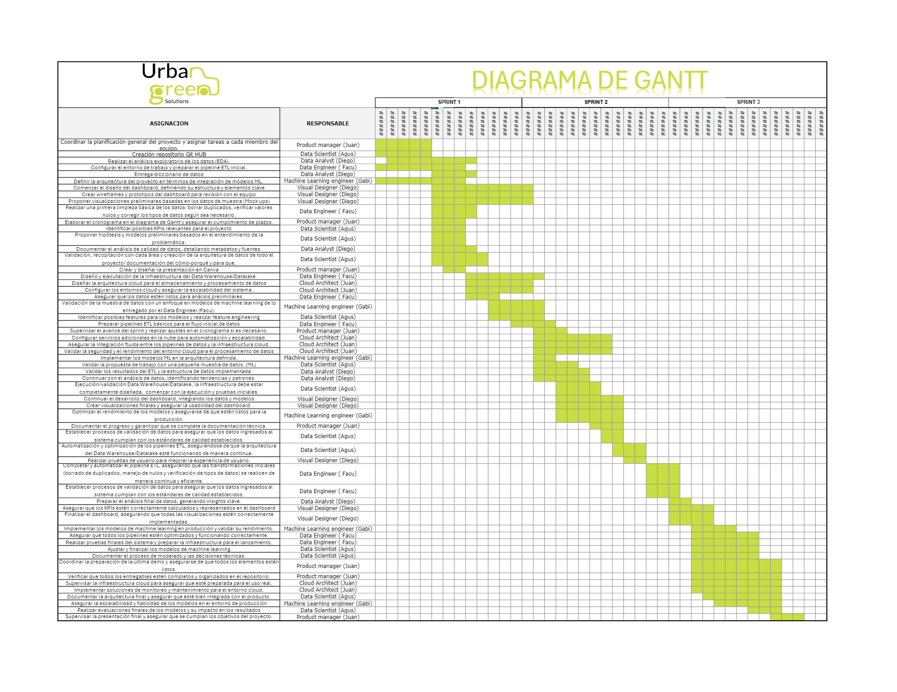

# <h1 align=center> **PROYECTO FINAL - Grupo 4 (Data PT 09)** </h1>

# <h1 align=center>**`Análisis Integral del Sector de Transporte de Pasajeros en Nueva York`**</h1>

  

## **Descripción del proyecto**

**Staff:**
- Juan Aponte - Product Manager/Cloud Arquitect
- Facundo Dispenza - Data Engineer
- Agustín Niederle - Data Scientist
- Gabriel Cañete - Machine Learning Engineer
- Diego Camacho - Data Analyst

## Contexto

En la ciudad de nueva york existen miles de taxis en servicio de manera continua. Existen tres tipos diferentes de taxis: Amarillos, Verdes y Negros. Cada tipo de taxi tiene sus zonas designadas; el amarillo es el único que puede subir y bajar pasajeros en Manhattan, por ejemplo. Para esto, los taxis amarillos tiene que comprar su registro de habiltitación para poder otorgar dicho servicio en esta zona, que además, es por mucho, la de mayor caudal de pasajeros y por ende, la más rentable. Este registro ha llegado a valer un millón de dolares antes de la aparición de Uber; hoy fluctua entre los 200 mil dolares. Esto generó un conflicto por los registros de habilitación para taxis amarillos.
Por otro lado, en 2021, a cuasa de la crisis ambiental, el presidente Biden aprobó una ley que busca renovar los taxis por modelos modernos con combustibles de energía alternativa, con el fin de reducir el impacto ambiental de este servicio de transporte. En nueva york, existen diversas estaciones de energía electrica -principal energía alternativa en el país-, lo que hace operativamente posible el objetivo de la ley: un recambio total de los automóviles para finales el 2025. Actualmente los taxis amarillos se encuentran en crisis, debido a que los taxis particulares como Uber, captan sus clientes y no les permiten subir la tarifa a un valor que les resulte rentable para pagar los prestamos que sacaron para comprar las habilitaciones. Por esto, los taxis verdes (que trabajan fuera de Manhattan), son los que aún permiten el ingreso de nuevos servicio, pero ¿de què manera se podría realizar de una manera rentable?. En este trabajo buscaremos responder esta pregunta clave.

## Público Objetivo
Empresa de transporte de pasajeros a larga distancia que busca introducir taxis en Nueva York.

## Propuesta de sectorización del negocio
Creemos conveniente para esta empresa que busca ingresar a otorgar servicios de taxis, introducir su servicio específico para los pasajeros de los servicios de transporte de larga distancia (autobuses y aviones). Actualmente pasan por los aeropuertos de nueva york, más de 10 millones de pasajeros por mes (13 millones en julio de 2024, ver Fuente *). Esto permitiría captar una zona del mercado lo suficientemente grande y que aún no posee la competencia y la sobreoferta presente en el servicio actual de taxis convencionales.

[fuente](https://www.panynj.gov/airports/en/statistics-general-info.html)*

## Perfil diferenciador del negocio
Hemos hecho incapié en ser ecológicamente activos a la hora de pensar el nuevo servicio de taxis. Por esto, creemos que nuestro diferencial, respecto a otros servicios de transporte que captan clientes en los aeropuertos, debe que provenir desde esta búsqueda; tanto para los usuarios como para la empresa de taxis. Desde el punto de vista de la empresa, también resulta de gran utilidad y eficiencia económica, porque conocer o estimar el número de clientes para poder ingresar al aeropuerto/terminal sólo con las unidades necesarias permitiría eliminar las esperas inútiles y los lapsos de actividad no rentados.

## Propuesta General

Crear una app que asocie a los pasajeros que hacen caminos similares o van a destinos en las mismas zonas de NY, para recomendarles viajes compartidos en taxis eléctricos que permitan un servicio cómodo, de menor costo y más comprometido ecológicamente, ya que permite ayudar a reducir congestiones de tráfico, ruido ambiente y, sobre todo, la huella de carbono. :muscle:

## **Análisis Propuesto:**
Conocer las oportunidades, costos y posibles ganancias de un nuevo servicio de taxis en la ciudad de Nueva York.
  
## **Objetivos Puntuales:** 
Teniendo en cuenta la información de estaciones de carga eléctrica, el modelo y el rendimiento de vehículos, los costos del combustible, impuestos y peaje, las zonas más congestionadas y sus restricciones legales, nos planteamos poder recomendar un tipo de servicio rentable que, además, esté planteado con facilidades para el despliegue de un negocio con proyección. Incluyendo una APP para la reserva y la recomendación de los mejores caminos posibles para el taxi y modelo de recomendación para acompañantes manejado por el usuario, quien además podrá conocer el ahorro de su huella de Carbono gracias al uso de sservicio de viajes compartidos.
  
## **Alcance del proyecto**
Generar un respaldo de datos, estructura y stack tecnológico para la inteligencia suficiente durante el despligue y puesta en marcha del negocio planteado. Una vez operativo el serivicio, la aceptación del serivicio y el crecimiento de usuarios dependerá de factores no tratados en este análisis (publicidad, presencia institucional, calidad del serivicio, por ejemplo).

## **Propuesta comercial del trabajo**
Todo viajero o viajera desea llegar y tener resuelta la lelgada al hotel, o el regreso a su casa. Luego de un larguísimo viaje entre aeropuertos, o durante horas enteras en la ruta, aún no hemos llegado al destino. Aún falta el último paso. Aún puede que nos cobren más de lo que corresponde, que nos lleven por el camino más largo, que sea tarde y no consigamos servicio, que todos los taxis estén ocupados y la espera y el viaje se alargue aún más, etc. Nada resultaría más útil que poder resolverlo con facilidad, claridad y confianza. Por esto, AirTaxi crea una solución: facilitar el último paso de tu viaje.

**`Modelos ML`**:
Al asociarnos con las empresas de bus (incluso la propia) y las de aviones, se podrí captar a clientes antes de que toquen la pista de aterrizaje usando una APP que les permita reservar su viaje, identificando la zona de destino: esto permitirá sugerir al usuario los compañeros de viaje según el destino y otras preferencias a indicar en la misma (primer modelo ML) y tambien, los caminos óptimos al chofer del Taxi en cuestión (segundo modelo ML). 
Consiguiendo los datos de vuelos y de empresas de transporte de larga distancia, para conocer el número los pasajeros que llegan a NY por día y horario, podemos estimar la cantidad de usuarios potenciales. Al conocer el costo de enería electrica por auto por hora, podríamos tener valores certeros del negocio.

**`KPIs` propuestos**:

+ a KPI 1: Shared travel (% de reducción de la huella de carbono): 
Descripción: Cantidad de CO2 reducido al compartir el viaje (en el caso de los autos eléctricos sería el CO2 de la producción de la energía eléctrica que usa por el viaje). A mayor cantidad de personas por viaje, menor es el valor.

+ b KPI 2: Reducción del tiempo de inactividad/espera por vehículo.
Descripción: Los tiempos de inactividad por falta de pasajeros se pueden reducir al generar reservas previas por medio de la app, pero además se puede plantear una triangulación entre aeropuertos y terminales para que el chofer tenga las distancias entre pasajeros lo más cortas posibles.

+ c KPI o eficiencia operativa= (tiempo de viaje con pasajero)/tiempo total 
*Tiempo total = tiempo de recarga de energía + tiempo de viaje con pasajero + tiempo de viaje sin pasajero (regreso a estación, por ejemplo)
Descripción: Mide cómo la APP puede reducrir los tiempos de esperay optimizar la ganancia del chofer y de la empresa.  

**Detalles Técnicos ( Diego)**

- **Análisis preliminar de calidad de datos (EDA**

 

##### Resumen de los datos otorgados: 
Podemos encontrar en los datos otorgados por el Product Owner, que ya hay una identificación clara de disponibilidad de estaciones de servicio por zonas (dataset1: Alternative_Fuel_Vehicles_US) y por tipo de energia (con dataset2: Electric and Alternative Fuel Charging Stations). A esto se suma la eficiencia de cada modelo (dataset 3: ElectricCarData_Clean), con el costo de adquisición (en euros), versus eficiencia y cantidad de asientos (dataset4:ElectricCarData_Norm), 
Por último, el atributo Rapid Charge, es información útil para poder evaluar los tiempos de operatividad propuestos en el KPI 1.
El Dataset5 (Light Duty Vehicles), por otro lado, tiene los ID de los vehículos, sus fabricantes y los códigos de combustibles nomenclados.

- **Arquitectura del proyecto**
## **Arquitectura del proyecto**

- **Cronograma general del proyecto (Gantt):**

[link](https://docs.google.com/spreadsheets/d/1AQ29tg_Rf70jkreNERpkFYWSLuZHVaZXYMhSw0qgopQ/edit?gid=0#gid=0)

